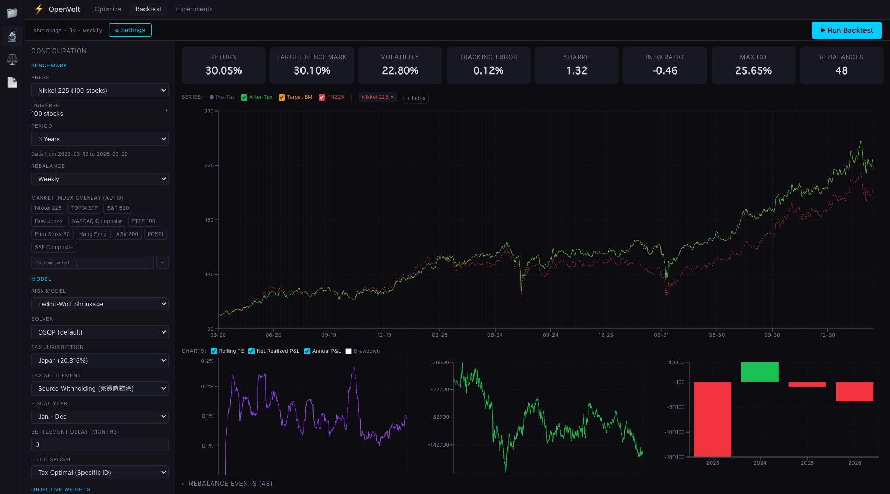
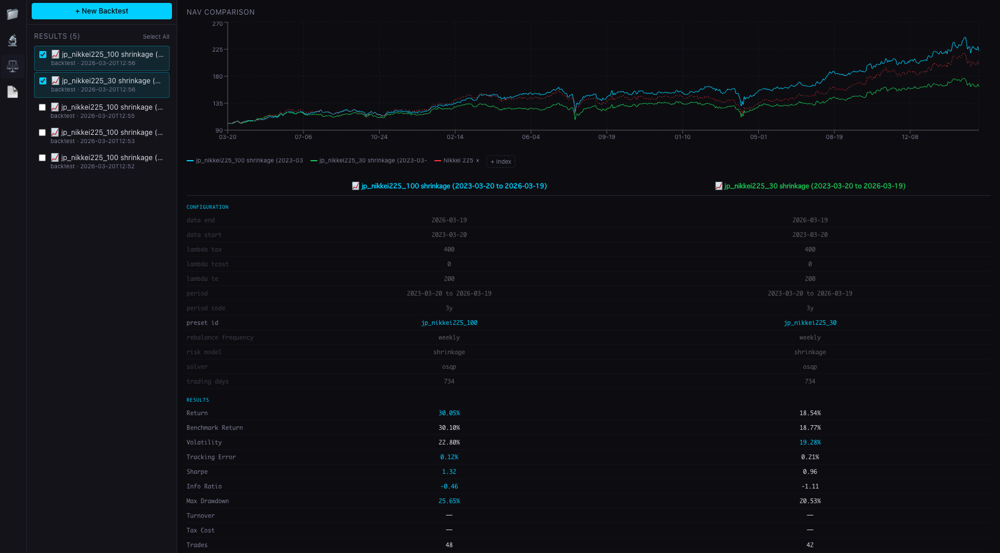
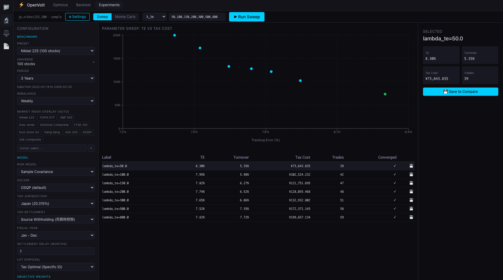
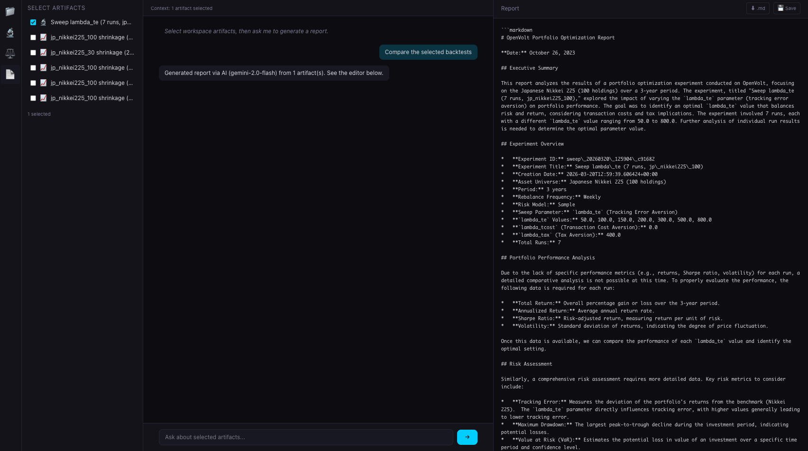

# OpenVolt ⚡

**Tax-aware portfolio optimization with C++20 performance and a full-stack UI.**

OpenVolt solves the real problem of portfolio rebalancing: minimize tracking error while accounting for transaction costs and tax consequences — simultaneously. Built with a C++20/OSQP core, Python bindings, and an interactive React console.

- **C++20 + OSQP** — institutional-grade QP solver, not a Python wrapper
- **Tax-aware optimization** — Japan (20.315%) and US (ST/LT + wash sale) tax models
- **Full-stack UI** — rolling backtests, parameter sweeps, Monte Carlo, side-by-side comparison



## Why OpenVolt

Individual investors using direct indexing (owning individual stocks instead of ETFs) face a complex optimization problem: rebalance to track a benchmark, minimize trading costs, and harvest tax losses — all at once. Existing tools solve only part of this:

| Project | What it does | What it doesn't |
|---|---|---|
| **PyPortfolioOpt** | Textbook mean-variance | No tax awareness, no UI |
| **OpenBB** | Data & visualization | No optimization engine |
| **QuantLib** | Derivatives pricing | No portfolio optimization |
| **NautilusTrader** | Execution engine | No tax-aware construction |
| **Freqtrade** | Crypto trading bot | No portfolio optimization |
| **OpenVolt** | **Tax-aware optimization + backtests + UI** | — |

## The Optimizer

```
minimize   λ_te · (w - w_b)' Σ (w - w_b)           tracking error
         + λ_tcost · Σ|w_i - w_c_i|                 transaction cost
         + λ_tax · Σ max(0, gain_i) · τ · |Δw_i|    tax cost

subject to  Σw = 1,  0 ≤ w ≤ cap,  turnover ≤ limit
```

Reformulated as a QP with auxiliary variables and solved via OSQP in C++20.

## Features

### Core Engine (C++20)
- **5 risk models** — Sample covariance, EWMA, Ledoit-Wolf shrinkage, PCA factor model, blend
- **Multi-objective QP** — Tracking error + transaction cost + tax cost
- **Tax lot tracking** — FIFO, LIFO, specific identification (tax-optimal default)
- **Tax policies** — Japan (flat 20.315%, no wash sale) and US (ST/LT rates, 30-day wash sale rule)
- **Validated** — cvxpy parity tests (weight differences < 10⁻¹⁰)

### Backtest & Experiments
- **Rolling backtests** — Weekly/monthly/daily rebalancing with live yfinance data
- **After-tax NAV** — Pre-tax and after-tax performance on the same chart
- **Parameter sweeps** — Sweep λ values, compare results side by side
- **Monte Carlo** — Random parameter perturbation with aggregate statistics
- **Market index overlay** — Add Nikkei, S&P, or any yfinance symbol for comparison

### UI Console (React)
- **Backtest view** — NAV chart, rolling TE, P&L, drawdown, rebalance events
- **Compare view** — Side-by-side metrics + NAV overlay for multiple runs
- **Experiments** — Scatter plots, run tables, save-to-compare workflow
- **Reports** — AI-powered report generation (Gemini API)
- **Explorer** — Workspace with saved results, artifacts, file browser

<details>
<summary>Screenshots</summary>

**Compare** — Side-by-side NAV overlay + config diff + metrics


**Experiments** — Parameter sweep with scatter plot


**Reports** — AI-powered report generation


</details>

### Tax Settlement Models
- **Source withholding** — Immediate deduction (Japan 特定口座 model)
- **Annual filing** — Year-end settlement with configurable delay
- **Custom** — Configurable fiscal year and settlement timing

## Quick Start

### Prerequisites

```bash
# macOS
brew install cmake eigen osqp

# Ubuntu
sudo apt-get install cmake libeigen3-dev libosqp-dev
```

### Build & Run

```bash
# 1. Clone
git clone https://github.com/ajtgjmdjp/OpenVolt.git
cd OpenVolt

# 2. Build C++ core + Python bindings
python3 -m venv .venv && source .venv/bin/activate
pip install pybind11 numpy

PYBIND11_DIR=$(python -c "import pybind11; print(pybind11.get_cmake_dir())")
cmake -B build -DCMAKE_BUILD_TYPE=Release -DOPENVOLT_BUILD_PYTHON=ON -Dpybind11_DIR="$PYBIND11_DIR"
cmake --build build -j$(nproc 2>/dev/null || sysctl -n hw.ncpu)

# 3. Install Python dependencies
cd api && pip install -r requirements.txt && cd ..

# 4. Build frontend
cd web && npm install && npm run build && cd ..

# 5. Run
cd api && uvicorn app.main:app --port 8000 &
cd ../web && npm run dev
# Open http://localhost:5173
```

### Python API

```python
import numpy as np
import _openvolt as ov

# Define portfolio
portfolio = ov.PortfolioState(
    as_of="2026-03-17", cash=5000.0,
    lots=[
        ov.TaxLot(1, "AAPL", 50.0, 160.0, "2025-01-15"),
        ov.TaxLot(2, "MSFT", 30.0, 400.0, "2025-06-01"),
    ],
)

# Risk model (sample covariance)
risk = ov.FullCovarianceRisk(
    asset_ids=["AAPL", "MSFT", "NVDA"],
    covariance=np.array([
        [0.04, 0.01, 0.005],
        [0.01, 0.03, 0.008],
        [0.005, 0.008, 0.06],
    ]),
)

# Market data
market = ov.MarketData(
    as_of="2026-03-17",
    asset_ids=["AAPL", "MSFT", "NVDA"],
    prices=np.array([200.0, 450.0, 900.0]),
    benchmark_weights=np.array([0.40, 0.35, 0.25]),
    transaction_cost_bps=np.array([2.0, 2.0, 5.0]),
    risk_model=risk,
)

# Configure optimizer
config = ov.OptimizationConfig()
config.taxes.disposal_method = ov.DisposalMethod.specific_id
config.taxes.short_term_rate = 0.20315  # Japan

# Optimize
result = ov.plan_rebalance(ov.RebalanceRequest(portfolio, market, config))

for trade in result.trades:
    print(trade)
print(f"Predicted TE: {result.diagnostics.ex_ante_tracking_error:.2%}")
```

## Architecture

```
OpenVolt/
├── core/                    # C++20 engine
│   ├── risk/                # 5 covariance estimators
│   ├── optimizer/           # OSQP QP solver
│   ├── models/              # Tax policy, config, data types
│   ├── portfolio/           # NAV, returns, drawdown
│   └── simulation/          # Rolling backtest engine
├── python/                  # pybind11 bindings
├── api/                     # FastAPI backend
│   ├── routes/              # REST endpoints
│   ├── services/            # Business logic + TaxEngine
│   └── data/                # Presets + constituents
├── web/                     # React + Vite + Recharts
│   ├── views/               # Backtest, Compare, Experiments, Reports
│   ├── components/          # ConfigPanel, Explorer, Charts
│   └── store/               # Zustand state management
├── docs/                    # Tax rules reference (primary sources)
└── tests/                   # 31 C++ tests + cvxpy parity
```

## Tech Stack

| Layer | Technology |
|---|---|
| Core | C++20, Eigen 5, OSQP 1.0 |
| Bindings | pybind11 |
| Backend | FastAPI, uvicorn |
| Frontend | React 19, Vite, Recharts, Tailwind CSS |
| Data | yfinance, SQLite (workspace) |
| AI Reports | Gemini API (optional) |
| Tests | Google Test |

## Roadmap

- [ ] Docker Compose for one-command setup
- [ ] Linux CI (GitHub Actions)
- [ ] Prebuilt Python wheels
- [ ] Sector constraints
- [ ] Factor tilt strategies
- [ ] Multi-currency support
- [ ] Hosted demo

## Who This Is For

- **Quant developers** building tax-aware portfolio systems
- **Portfolio managers** evaluating direct indexing strategies
- **Individual investors** optimizing tax-loss harvesting
- **Researchers** studying multi-objective portfolio optimization

## Contributing

See [CONTRIBUTING.md](CONTRIBUTING.md) for guidelines.

## License

[AGPL-3.0](LICENSE) — Professional-grade quant models, open to everyone.
